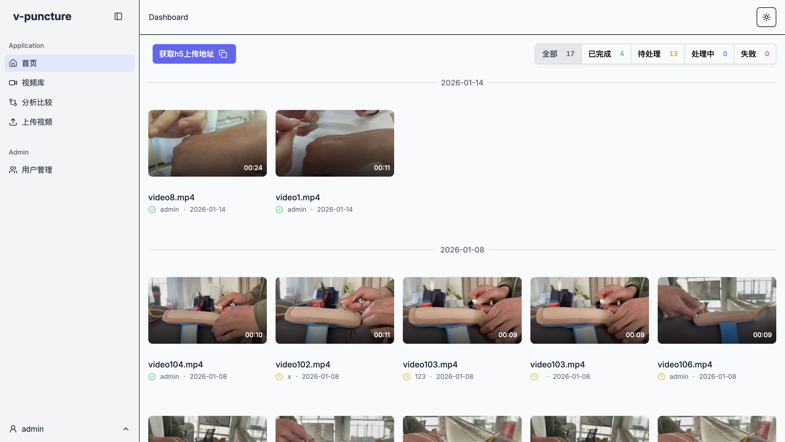
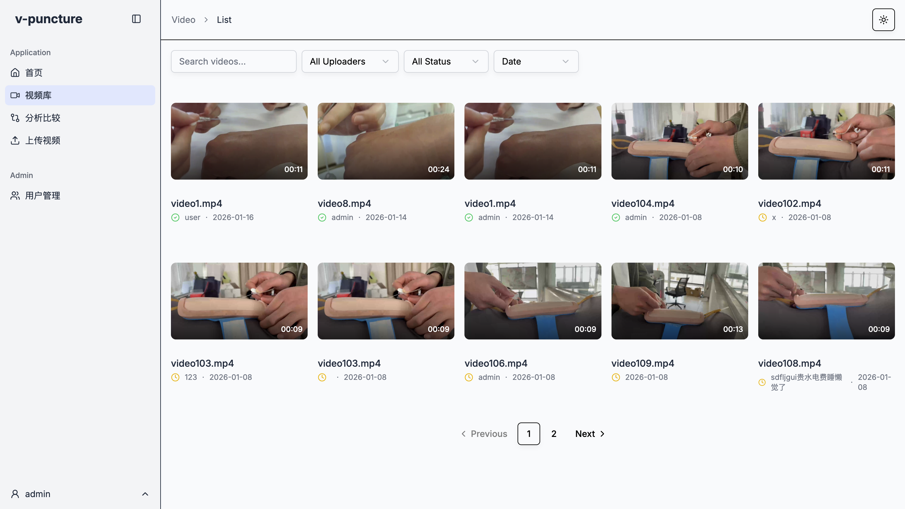
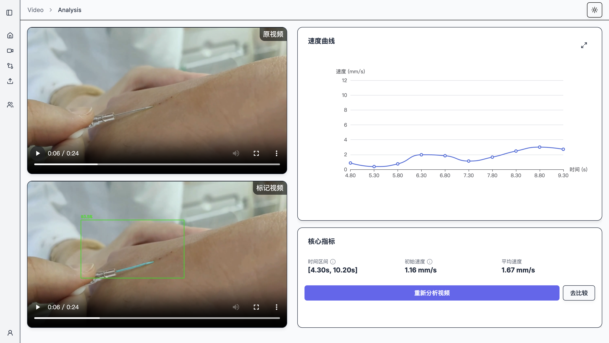
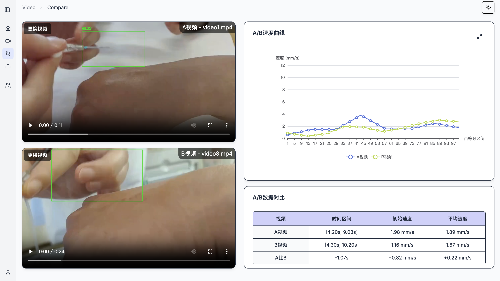
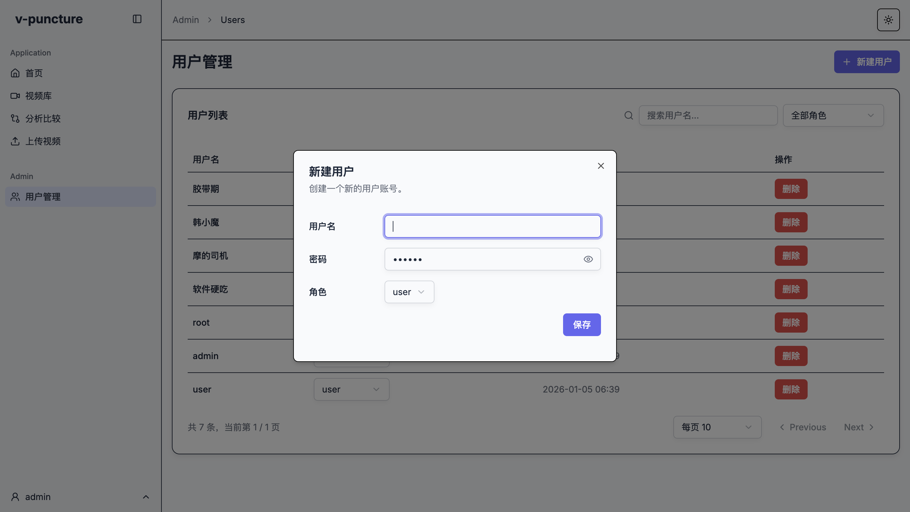

# video-puncture-speed · 视频穿刺速度分析平台

video-puncture-speed 是一个面向视频场景的穿刺操作分析平台，用于对穿刺相关视频进行自动检测、分割和速度统计。  
系统通过深度学习模型对视频中的关键目标和区域进行识别与分割，并结合前后端一体化的可视化界面，为用户提供直观的分析结果和数据看板。

---

## 1. 项目介绍

本项目的核心目标是对穿刺类操作视频进行自动化分析，包括但不限于：

- 对视频中感兴趣目标（如器械、关键区域等）进行检测与跟踪
- 使用分割模型获取精确的区域轮廓
- 基于检测/分割结果计算穿刺相关的速度与时序指标
- 在前端页面中以图表、列表和视频叠加等方式进行可视化展示

整体架构分为三部分：

- 前端：提供数据看板、视频列表、用户管理和分析结果展示等页面
- 后端：负责任务管理、接口服务、数据处理与模型推理调度
- 视频分析：基于 PyTorch、YOLO 和 Menet 分割模型，对上传的视频进行深度学习推理和分析

---

## 2. 技术栈

### 前端

- Typescript
- React

前端主要负责：

- 视频列表和分析任务的管理与展示
- 分析结果（检测框、分割掩膜、速度曲线等）的可视化
- 用户管理和基础配置界面

### 后端

- Python
- FastAPI

后端主要负责：

- 提供 RESTful API 接口（任务创建、状态查询、结果获取等）
- 管理视频文件与分析任务队列
- 调度模型推理服务，并对推理结果进行整理与存储

### 视频分析

- PyTorch
- YOLO（目标检测）
- Menet（分割模型）

视频分析模块主要负责：

- 对视频逐帧/分段进行检测和分割
- 提取穿刺相关的关键帧和动作信息
- 基于检测和分割结果计算速度、时长等统计指标
- 将处理结果返回给后端，供前端展示

---

## 3. 部分截图展示

### 我的视频

### 视频库

### 视频分析

### 视频分析结果对比

### 用户管理

